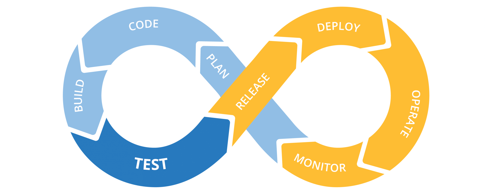
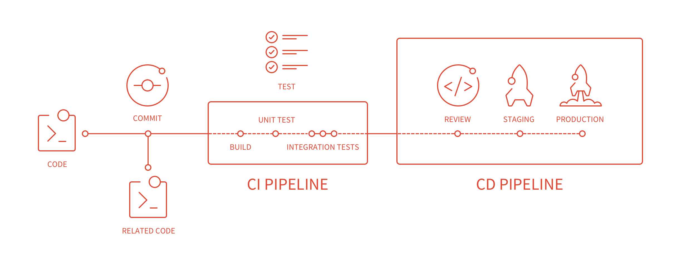
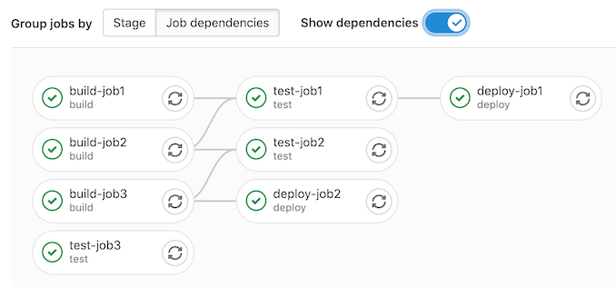
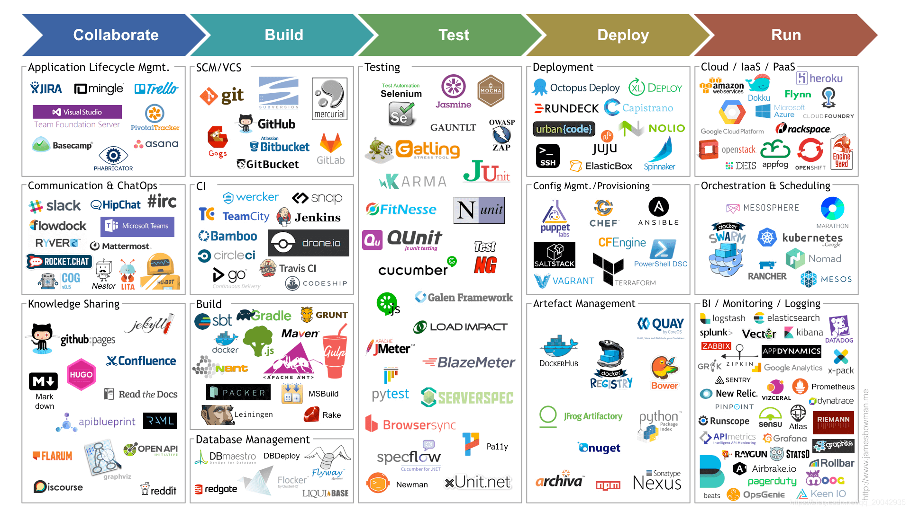

# [DevOps] CI/CD 介紹 - 基礎概念與導入準備

<!--more-->

<!-- # CI/CD Introduction - 概念與導入前準備 -->

## 前言

自從去年初啟動“敏捷”(Scrum)導入，幾乎都在適應(迭代)各種流程、方法和工具，工程實踐方面的單元測試和 CI/CD 推行計畫卻一直往後延。如今，因應團隊一個大型系統要進行前後端分離重構，加上大家對於容器化技術越來越熟悉，同時又有優秀的新夥伴加入，可謂是天時地利人和啊，我們終於要開始在“開發”上實踐敏捷，啟動 CI/CD 導入！

這此之前我對 CI/CD 的理解幾乎是一片空白，因此想利用這篇文章，記錄過程中的學習心得與知識整理。首先將介紹「什麼是 CI/CD？」、「為什麼要 CI/CD？」、「CI/CD 如何做？」以及「常見的 CI/CD 工具」，您可以透過右側選單快速跳轉至感興趣的章節。內容會比較初淺，~~請小心服用。~~ 歡迎給予任何反饋和指正～

## 什麼是 CI/CD？

敏捷式軟體開發生命週期中，從開發、測試到部署是一系列持續迭代的過程，[CI/CD](https://zh.wikipedia.org/wiki/CI/CD) 指的是[持續整合](https://zh.wikipedia.org/wiki/%E6%8C%81%E7%BB%AD%E9%9B%86%E6%88%90)和[持續交付](https://zh.wikipedia.org/wiki/%E6%8C%81%E7%BA%8C%E4%BA%A4%E4%BB%98)或[持續部署](https://zh.wikipedia.org/wiki/%E6%8C%81%E7%BA%8C%E9%83%A8%E7%BD%B2)的組合實踐。CI/CD通過在應用程式的構建、測試和部署中實施自動化，在開發和運營團隊之間架起了橋梁。

### CI 持續整合 (Continuous Integration)

每當開發人員 push 程式碼變更到 remote repository 時，觸發自動化 build 和 test 的程序，確保這次的變更是符合規範且通過所有測試案例的，減少有問題的程式碼影響到生產環境的機會。

### CD 持續交付 / 持續部署 (Continuous Delivery / Continuous Deployment)

完成 Build 和 Test 的下一步就是程式碼部署啦，而 Continuous Delivery 和 Continuous Deployment 的差別就是人為手動部署和自動化部署而已。

### CI/CD Workflow

從上面這張流程圖的可以看出 CI/CD 主要的工作流：(1)當專案程式碼提交 (commit → push / merge)；(2)進入 CI Pipeline，建立一個測試環境，跑過所有單元測試+整合測試、程式碼規範檢查；(3)進入 CD Pipeline，完成程式碼部署。


看完前面的介紹，可能會認為 CI/CD 只是寫腳本跑自動化測試 + 自動部署，然而 “Continuous” 的意義是“頻繁地”釋出新版本，降低過大變動帶來的問題與衝突，從 3 個月發佈 1 次，到 1 天發佈 3 次，達到敏捷精神中小步快跑、快速迭代的狀態。


## 為什麼要 CI/CD？

想像一下，上述流程若都交給開發人員手動執行，不僅要花大量操作時間和等待時間，還可能會有人為失誤產生，更何況 CI/CD 要我們頻繁做這些事，導致成本大幅增加。

### CD/CD 的好處

")

CI/CD 可以為團隊帶來以下好處，同時也是我們所追求的目標：

1. 避免版本衝突
2. 降低人為操作失誤
3. 減少人工時間花費
4. 及早發現(bug)及早修正(fix)
5. 專注開發提高生產力
6. 加速產品迭代


這些目標其實都不太具體，還需要進一步透過量化指標來評估 CI/CD 成效，有興趣的朋友可參考這篇 [衡量和監控 CI/CD 性能](https://www.jetbrains.com/zh-cn/teamcity/ci-cd-guide/devops-ci-cd-metrics/)。


## CI/CD 如何做？

為了達到快速又頻繁的新版本發佈，必須要有嚴謹和穩健的流程，從前面的 CI/CD Workflow 可見步驟相當繁瑣且有相依性，因此需要透過工具和指令，有效地自動化幫我們執行這些程序。

### 先備知識與技能

做 CI/CD 之前，建議團隊要有一定的成熟度，才能快速將現有的程序轉換為自動化的方式運行，以下是我認為必須先具備的知識和技能，導入 CI/CD 時較能快速上手：

- **Shell Script(Command)**：與作業系統 Kernel 互動的語言(指令)是一切的基礎
- **SSH 連線**：創建公鑰和私鑰，以特定使用者連線至遠端 Server 進行操作
- **Git 版本控制**：任何一種 Git workflow，用來管理分支、切換版本、合併流程
- **容器化技術**：用來隔離環境，快速搭建和部署（e.g. docker, docker-compose)
- **程式碼規範檢查**：檢查你的程式碼，是否符合團隊規範的程式碼風格
- **單元測試、整合測試、自動化測試**：檢查你的程式碼，能否在目標環境正常運作

### 流程與準備

上述的知識與技能你都已經掌握了之後，開始盤點 CI/CD 各個步驟會用到的指令，接著確認這些指令的順序（哪些具有相依性？哪些可以平行化？）

 

<!--  -->



先將工作流程的 DAG ([Directed Acyclic Graph，有向無環圖](https://zh.wikipedia.org/wiki/%E6%9C%89%E5%90%91%E6%97%A0%E7%8E%AF%E5%9B%BE))畫出來，然後手動執行一遍所有流程（這時有就能感受到人工做這些事其實相當繁瑣及耗時），下一步就是將相同的程序透過工具自動化執行啦！


### CI/CD 工具

常見的 CI/CD 工具有 Jenkins、GitLab、Circle CI、Travis CI、Drone 等，另外，各大雲端平台(AWS, GCP, Azure)也有推出 CI/CD 解決方案，更好地整合了自家的雲端服務。

一般我們會希望這些工具通常具備以下功能：

- 最基本的建立、編輯腳本
- 相容各 Git 程式碼託管平台
- 視覺化呈現工作流(Workflow)、狀態(Status)和進度(Progress)
- 管理不同使用者權限(Maintainer, Developer, Reviewer, etc.)
- 可將任務分散給多個 Runner / Worker 執行
- 設定成功 / 失敗發送信件通知
- 支持第三方工具整合
- ...


我目前團隊用的程式碼託管平台是 GitLab，評估過後發現 [GitLab 的 CI/CD 解決方案](https://docs.gitlab.com/ee/ci/)很棒，因此選用為我們的工具，並開始逐步導入。（之後文章將會介紹使用方式）


## 總結

好的 CI/CD 可以幫助團隊減少人為失誤，提高生產力，加速產品迭代；壞的 CI/CD 可能會導致流程更加混亂，增加人力除錯成本，造成品質低落。

所以你應該依團隊目前的成熟度，逐步將 CI/CD 各個環節添加進去，不需要一次就全部導入，例如：單元測試尚未落實的團隊，進入 CI 階段前可以先透過 Code Review 檢查；自動部署尚未穩定的團隊，CD 階段可以只做到自動交付，保留最後一步由人工進行部署。

最後，期望團隊今年可以在各大專案中導入，也期許自己保有持續輸出(Continuous Output)、持續分享(Continuous Sharing)的精神XD

 

## 參考

[https://docs.gitlab.com/ee/ci/](https://docs.gitlab.com/ee/ci/)

[https://www.redhat.com/zh/topics/devops/what-is-ci-cd](https://www.redhat.com/zh/topics/devops/what-is-ci-cd)

[https://bear-1111.medium.com/什麼是-ci-cd-72bd5ae571f1](https://bear-1111.medium.com/%E4%BB%80%E9%BA%BC%E6%98%AF-ci-cd-72bd5ae571f1)

[https://blog.kennycoder.io/2020/04/07/CI-CD-持續性整合-部署-因為懶，所以更要CI-CD！概念講解！/](https://blog.kennycoder.io/2020/04/07/CI-CD-%E6%8C%81%E7%BA%8C%E6%80%A7%E6%95%B4%E5%90%88-%E9%83%A8%E7%BD%B2-%E5%9B%A0%E7%82%BA%E6%87%B6%EF%BC%8C%E6%89%80%E4%BB%A5%E6%9B%B4%E8%A6%81CI-CD%EF%BC%81%E6%A6%82%E5%BF%B5%E8%AC%9B%E8%A7%A3%EF%BC%81/)

 
 

