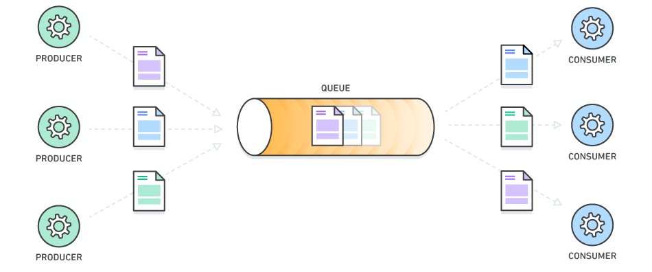

# [DATA] 訊息佇列 01 - Message Queue 介紹與實際應用

<!--more-->

<!-- # 訊息佇列 Message Queue(MQ) 介紹 -->

## 前言

這陣子團隊在開發**相似商品搜尋**的 ML Product，為了要把系統架構解耦，改為**異步分散式處理**，因而接觸到訊息佇列(Message Queue)，作為兩個子系統（商品資料處理 & 特徵向量轉換）的通信中間層。我將透過四篇文章分享我在使用 RabbitMQ 與 Python 實作的學習。

 

**[ 系列文章目錄 ]**
1. [[DATA] 訊息佇列 01 - Message Queue 介紹與實際應用](/message-queue/)（本篇）
2. [[DATA] 訊息佇列 02 - RabbitMQ 簡介與 5 種設計模式](/rabbitmq-intro/)
3. [[DATA] 訊息佇列 03 - RabbitMQ 架設方法與網頁管理介面](/rabbitmq-management-interface/)
4. *[DATA] 訊息佇列 04 - RabbitMQ x Python 程式實作範例（待完成）*
<!-- 2. [[DATA] 訊息佇列 02 - RabbitMQ 設計模式與管理介面](/rabbitmq-intro/)
3. [[DATA] 訊息佇列 03 - RabbitMQ x Python 實作範例](/rabbitmq-python/) -->

## 什麼是 Message Queue(MQ)？
 

<!--  -->

Message Queue(MQ)是一種**訊息傳遞仲介**，架構中擁有三個角色，分別為 Producer、Broker 及 Consumer，提供不同程序(process)或不同系統(system)的非同步(asynchronous)溝通。


一般常見的 HTTP API 就屬於同步式方法，發送方(sender) 發出請求(request)，等待接收方(receiver) 處理完回應(response)，等待過程不能斷開連線去做其他事。


- Producer：產生 Message 的角色，可能是程式、感測器(sensor)等，負責將訊息傳送給指定的 Broker
- Broker：就是 Queue 本身（以不同名稱區分)，負責暫存訊息，再依序（先進先出）傳送給 Consumer
- Consumer：消化 Message 的角色（或稱為 Worker)，負責主動拿取或被動接收 Broker 的訊息
- Message：泛指在 Queue 之間流通的訊息（或稱為任務)，包含 routing info（標籤）& body（內容）

由於先進先出(FIFO)的特性，發送方(producer) 只要把訊息往 MQ(broker) 裡面丟，接收方(consumer) 就能夠依序從 MQ(broker) 中取出訊息，使雙方能夠**獨立運作**，不需要放在同一套系統內。

## 使用 Message Queue 有什麼好處？
### 任務緩衝

短時間內收到大量請求可能會導致系統過載，特別是 CPU / GPU 運算吃重(heavy computing)的情況，這時候 MQ 就發揮了緩衝的功能，Producer 不需等待地向 Broker 發送訊息(任務)；Consumer 依自己的資源和算力從 Broker 取出適量的訊息(任務)，處理完再繼續拿。

### 暫存容錯
若 Consumer 意外關閉，未處理完的訊息還會存在 MQ 內，並不會丟失，只要再把 Consumer 重啟，又可以接續處理。（通常可設定要暫存或是丟棄）

### 系統解耦
架構設計上拆分為不同元件(components)獨立開發，Producer、Broker 及 Consumer 不需部署在同一台機主機，不需知道彼此的 IP address，也不需使用相同的程式語言。
### 水平擴展


<!--  -->

Producer 可分散在不同來源、裝置收集（e.g. IoT applications）；Consumer 可以按照需求和資源，運行在多台機器上，加速訊息(任務)的消化和處理。

## 常見工具

Message Queue 常見的開源工具有 RabbitMQ、Redis、Kafka（不同特性可參考 [這篇](https://homuchen.com/posts/difference-bwtween-rabbitmq-and-kafka/)）。
雲端服務則是像是 GCP 的 Cloud Pub/Sub 和 AWS 的 Amazon SQS。


下一篇文章，我將介紹目前團隊所使用的 **RabbitMQ** 有哪些優勢、設計模式、架設方法等等。


## 實際應用

這是某相似商品比對產品的 ETL 架構圖（擷取簡化部分），任務是每天將商品資訊（圖片 & 文字）進行向量轉換，分為會使用到 CV 模型和 NLP 模型，由於 **GPU 運算負擔**比較重（機器資源、計算時間等），因此將系統拆分為下圖左邊紅底的 Producer 和右邊藍底的 Consumer。

 



Producer 負責**資料過濾**(data filtering)**特徵提取**(feature extraction)；Consumer 負責**任務收集**(task collecting)和**向量轉換**(vectorization)。兩個系統彼此不會直接溝通，而是將 Message 透過 Broker 暫存與傳遞，分為 Image Queue 和 Text Queue，並可以根據目標完成時間來調整 Producer 和 Consumer 的數量，加速任務的消化。

這樣的設計相對過去採用 HTTP 連線**效率提高**（不需互相等待）；部署在不同規格的機器(VM)，Producer 選用低規格的機器，Consumer 選用搭載 GPU 的機器，也可以大大地**降低成本**。

## 參考
[https://homuchen.com/posts/message-queue-advantages-use-cases/](https://homuchen.com/posts/message-queue-advantages-use-cases/)

[https://godleon.github.io/blog/ChatOps/message-queue-concepts/](https://godleon.github.io/blog/ChatOps/message-queue-concepts/)

 
 

<!-- ## 觀看更多 -->
<!-- 1. [[DATA] 訊息佇列 01 - Message Queue(MQ) 介紹](/message-queue/) -->
<!-- 2. [[DATA] 訊息佇列 02 - RabbitMQ 設計模式與管理介面](/rabbitmq-intro/)*（下一篇）* -->
<!-- 3. [[DATA] 訊息佇列 03 - RabbitMQ x Python 實作範例](/rabbitmq-python/) -->
