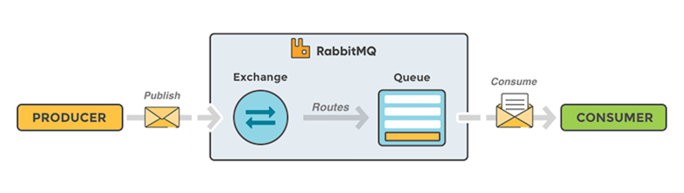

# [DATA] 訊息佇列 02 - RabbitMQ 簡介與 5 種設計模式

<!--more-->

<!-- # RabbitMQ 介紹 -->

## 前言
上一篇文章介紹完 Message Queue 是什麼後，這次要介紹的是知名且易用的實作工具 [RabbitMQ](https://www.rabbitmq.com/)，本篇文章將帶大家認識 RabbitMQ 的架構以及 5 種設計模式。

 

**[ 系列文章目錄 ]**
1. [[DATA] 訊息佇列 01 - Message Queue 介紹與實際應用](/message-queue/)
2. [[DATA] 訊息佇列 02 - RabbitMQ 簡介與 5 種設計模式](/rabbitmq-intro/)（本篇）
3. *[DATA] 訊息佇列 03 - RabbitMQ 架設方式與操作管理介面（待完成）*
4. *[DATA] 訊息佇列 04 - RabbitMQ x Python 程式實作範例（待完成）*

## RabbitMQ 簡介

- RabbitMQ 是使用廣泛的輕量級開源工具，支持 AMQP 0-9-1 等多種訊息傳遞協定。
- RabbitMQ 容易在本地端和雲端部署，滿足大規模(分散式)、高可用性的需求。
- RabbitMQ 為大多數流行的程式語言提供了多樣的[開發套件包](https://www.rabbitmq.com/devtools.html)。(Python, Java, Ruby, PHP, C#, JS, Go, etc.)
- RabbitMQ 提供了一個 Web 使用者介面來管理權限並監控各種狀態、指標。

## RabbitMQ 架構

    
看完上一篇我們已經知道 Message Queue 架構中的三個角色，在 RabbitMQ 中也延用相同概念：
- `Producer` 是發送訊息的應用程式
- `Queue` 是儲存訊息的緩衝區
- `Consumer` 是接收訊息的應用程式

不過在 RabbitMQ 中，根據不同設計模式會在 Producer 與 Queue 之間加上一層 `Exchange`：

- Exchange 的工作很簡單，透過`綁定(binding)`與 Queue 連結，負責接收來自 Producer 的訊息，然後將訊息推送給 Queue。
- 透過定義 Exchange 的類型(type)來判斷要如何處理收到的訊息，是要推送給哪個特定 Queue？還是要推送給多個 Queue？或是應該被丟棄？
- Exchange 的類型(type)有分為 `direct`, `topic` & `fanout`，文章下個段落介紹不同模式時會探討差別。

 

<!--    -->
## RabbitMQ 設計模式
根據 [RabbitMQ Tutorials](https://www.rabbitmq.com/getstarted.html) 官方的範例，展示了五種常見的模式（Python 範例程式碼附在標題後方連結）：

### 1. Simple 模式
*The simplest thing that does something* [(sample code)](https://www.rabbitmq.com/tutorials/tutorial-one-python.html)

<!---->

    
最基本的一種模式，只有一個 Queue(定義 Queue 的名稱)，Producer 直接將訊息傳進這個 Queue(hello)，也只有一個 Consumer 從這個 Queue(hello) 取出訊息。

### 2. Worker 模式
*Distributing tasks among workers* [(sample code)](https://www.rabbitmq.com/tutorials/tutorial-two-python.html)
    
<!---->


相比 Simple，Worker 模式會有兩個以上的 Consumer(Worker)，從同一個 Queue 取出訊息，且 Consumer 彼此間不會取得相同的訊息，**加速訊息處理(消化)速度**。因此只要連接同一個 Queue，就可以在多台機器上 Consumer **平行處理**。

。



可透過 `prefetch_count` 參數，控制每個 Consumer(Worker) 每一次取出的訊息數量，假設 Producer 將  1, 2, 3, 4, 5, 6, 7, 8, 9, 10  依序傳進 Queue：

在 **prefetch_count = 1** 的情況
 - `C1` 依序取出 `1`、`3`、`5`、`7`、`9` (共五次)
 - `C2` 依序取出 `2`、`4`、`6`、`8`、`10` (共五次)

在 **prefetch_count = 2** 的情況
 - `C1` 依序取出 `1,2`、`5,6`、`9,10` (共三次)
 - `C2` 依序取出 `3,4`、`7,8`(共兩次)

 

### 3. Publish/Subscribe 模式    
*Sending messages to many consumers at once* [(sample code)](https://www.rabbitmq.com/tutorials/tutorial-three-python.html)
    
<!---->

    
Publish/Subscribe 模式顧名思義，就像你訂閱某個 YT 頻道，當頻道創作者發佈了新影片，連同你的所有訂閱者都會收到通知。

Producer 不會將訊息直接傳進 Queue，而是交給 `Exchange (type=fanout)`，由於 fanout 的特性，Exchange 會把訊息廣播給所有綁定的 Queue，每個 Consumer 就會接收到相同的訊息。因此當有另外的系統需要同步接收訊息，只需增加一組 Queue + Producer，綁定這個 Exchange 即可。

### 4. Routing 模式 
*Receiving messages selectively* [(sample code)](https://www.rabbitmq.com/tutorials/tutorial-four-python.html)
    
<!---->

    
Routing 模式同樣有一層 `Exchange (type=direct)`，但不同的是 direct 的特性，Exchange 與 Queue 的綁定(binding)還會帶上 `routing key`，Producer 傳送訊息到 Exchange 時也會帶上 routing key 這個參數。因此可以達到選擇性訊息分流，不同 Consumer 只需要接受到特定 routing 的訊息。
        


        
上圖為此 **日誌系統(logging system)** 的範例，使用兩組 Queue：
 `Q1` 只有綁定一個 routing key(error)，因此負責寫檔(log file)的 `C1` 只會接收 error log messages，可節省硬碟(disk)空間。
 `Q2` 則是綁定多個 routing key(info, warning & error)，負責打印到控制台(console)的 `C2` 仍然可輸出所有層級(level)的 log messages。



### 5. Topics 模式 
*Receiving messages based on a pattern* [(sample code)](https://www.rabbitmq.com/tutorials/tutorial-five-python.html)
    
<!---->

    
Topics 與 Routing 模式很像，同樣有一層 `Exchange (type=topic)`，也透過 routing key 來分流訊息，差別在 topic 的特性能夠**模糊綁定**非固定的 routing key。 設定模糊 routing key 的 **patten** 必須是以 `.`(dot) 分隔的字串，`*`(star) 只能代替一個單詞、`#`(bash) 可以代替零個或多個單詞。


假設我們要發送的是「 **描述動物的訊息** 」，訊息將使用由三個單詞（包含兩個 `.`）組成的 routing key 發送，第一個單詞是 **"速度"**，第二個單詞是 **"顏色"**，第三個單詞是 **"物種"**：`<速度>.<顏色>.<物種>`。

我們將 Exchange 與 `Q1` 以 `.orange.` 綁定，與 `Q2` 以 `*.*.rabbit` 和 `lazy.#` 綁定，也就是：
 - `Q1` 會收到所有關於 **"橘色動物"** 的訊息
 - `Q2` 會收到所有關於 **"兔子"** 的訊息，以及所有關於 **"懶惰動物"** 的訊息

以下為 `P` 傳入的訊息及結果：
1. `quick.orange.rabbit` 會進入兩個 Queue：`Q1` 及 `Q2`
2. `lazy.orange.elephant` 會進入兩個 Queue：`Q1` 及 `Q2`
3. `quick.orange.fox` 會進入一個 Queue：`Q1`
4. `lazy.brown.fox` 會進入一個 Queue：`Q2`
5. `lazy.pink.rabbit` 會進入一個 Queue：`Q2`（僅一次，即使匹配兩個綁定）
6. `quick.brown.fox` 不會進入任何 Queue（與任何綁定都不匹配）

再讓我們看一些訊息**長度特殊**的案例：
1. `orange` 不會進入任何 Queue（違反 “.orange.”，前後各缺少一個單詞）
2. `quick.orange.male.rabbit` 不會進入任何 Queue（違反 `*.*.rabbit`，前後多出一個單詞） 
3. `lazy.orange.male.rabbit` 會進入一個 Queue：`Q2`（即使它有四個單詞，還是與 `lazy.#` 匹配）



## 參考
[https://godleon.github.io/blog/ChatOps/message-queue-concepts/](https://godleon.github.io/blog/ChatOps/message-queue-concepts/)

https://kucw.github.io/blog/2020/11/rabbitmq/

https://homuchen.com/posts/message-queue-advantages-use-cases/

https://www.cloudamqp.com/blog/part1-rabbitmq-for-beginners-what-is-rabbitmq.html

https://www.cloudamqp.com/docs/amqp.html

