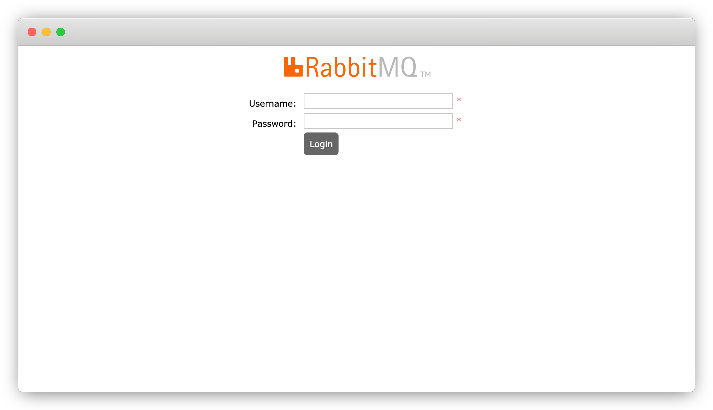
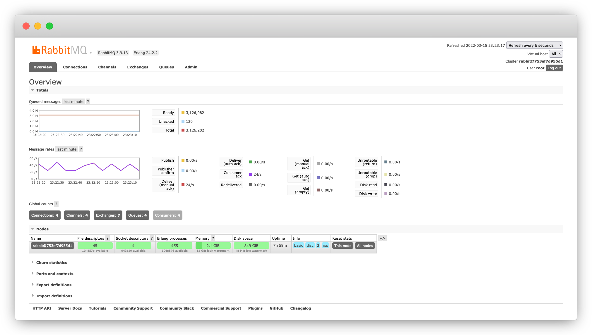
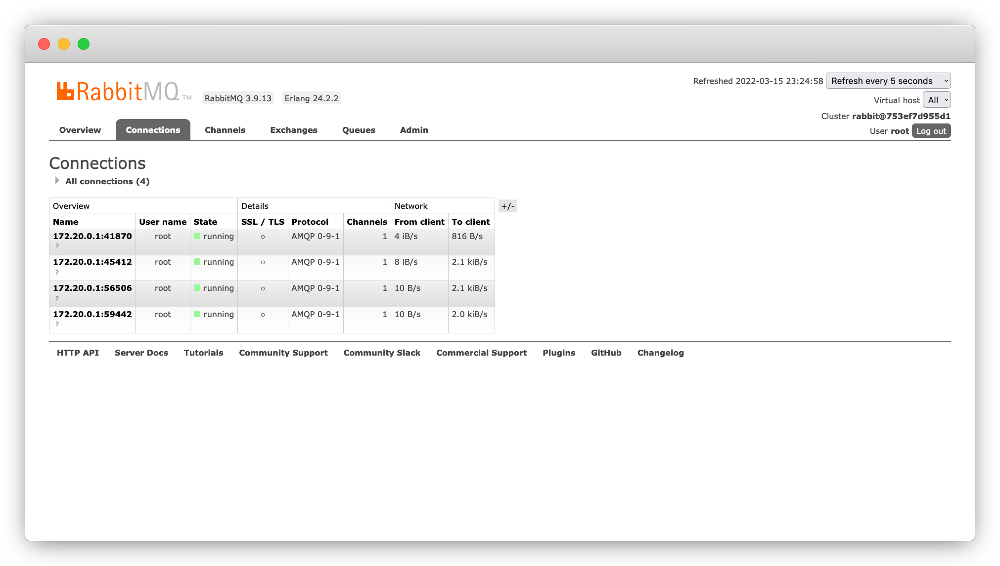
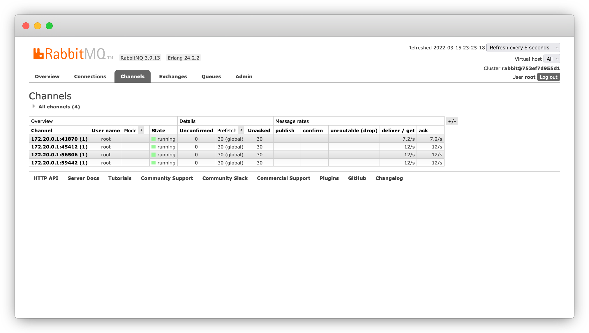
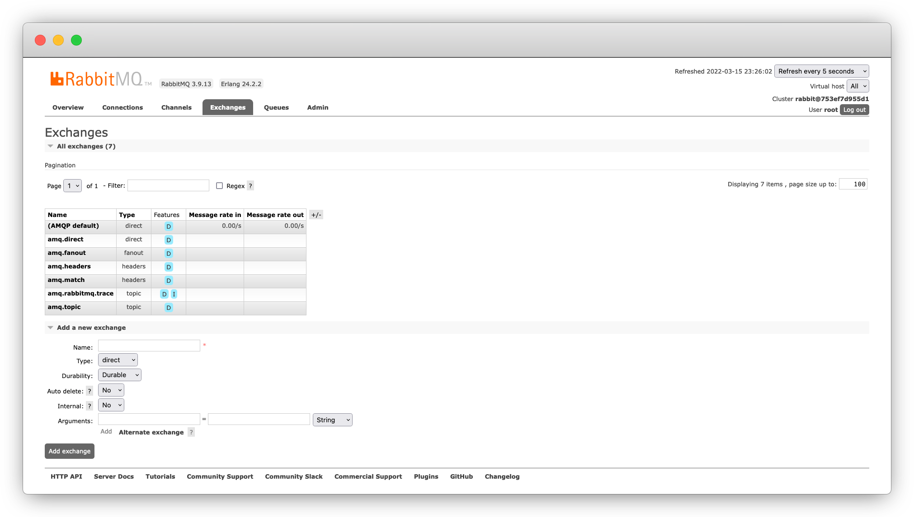
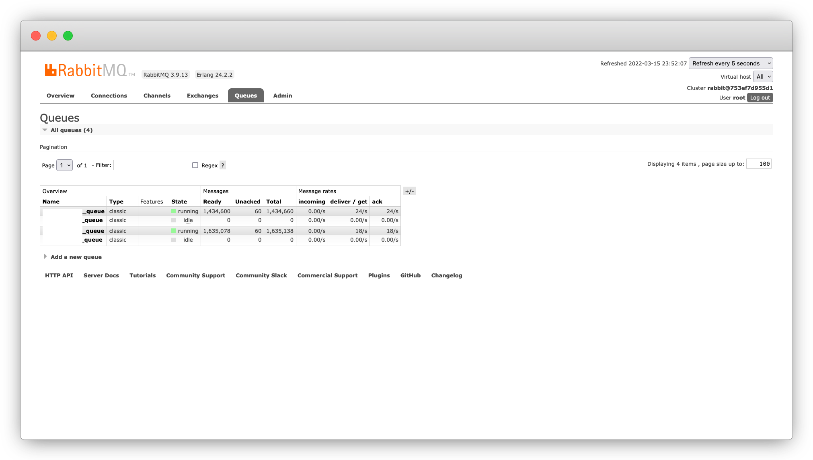
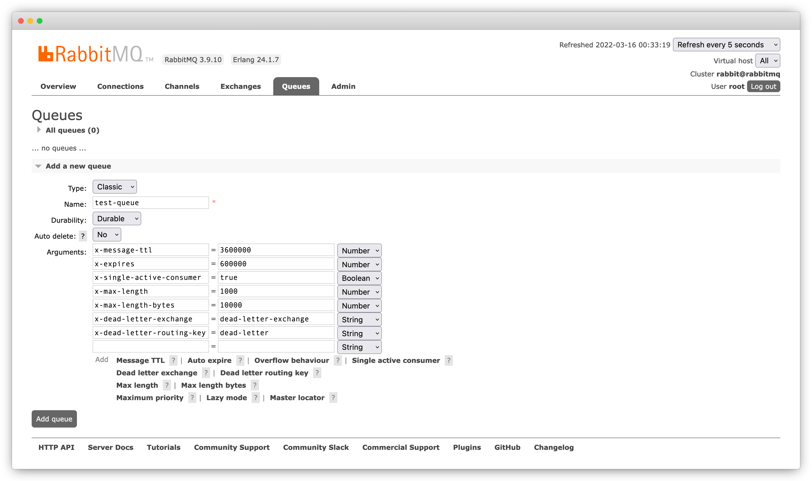
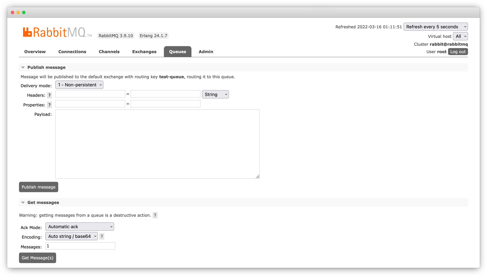
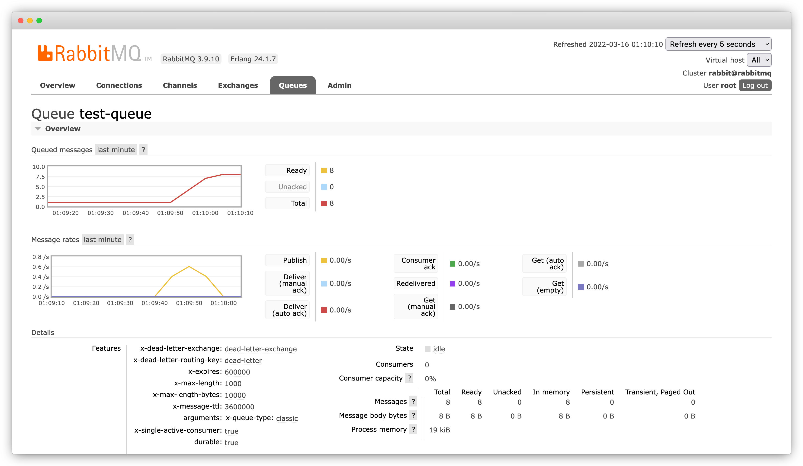
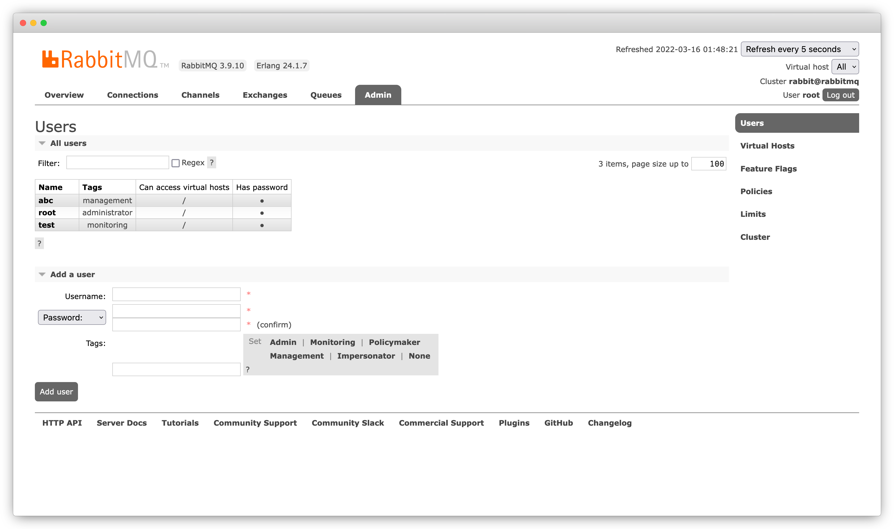

# [DATA] 訊息佇列 03 - RabbitMQ 架設方法與網頁管理介面

<!--more-->

## 前言
上一篇介紹完 RabbitMQ 的架構和設計模式，接下來就要告訴大家如何自己搭建 RabbitMQ Server，不用幾行程式碼就可以在你本機或是虛擬主機把服務架起來，還提供了一個 Web 管理介面方便你瀏覽和操作。

<br>

**[ 系列文章目錄 ]**
1. [[DATA] 訊息佇列 01 - Message Queue 介紹與實際應用](/message-queue/)
2. [[DATA] 訊息佇列 02 - RabbitMQ 簡介與 5 種設計模式](/rabbitmq-intro/)
3. [[DATA] 訊息佇列 03 - RabbitMQ 架設方法與網頁管理介面](/rabbitmq-management-interface/)（本篇）
4. *[DATA] 訊息佇列 04 - RabbitMQ x Python 程式實作範例（待完成）*

##  RabbitMQ 環境架設
RabbitMQ 官方有提供 RabbitMQ Server 在不同作業系統(Linux, MacOS & Windows)上的[安裝指南](https://www.rabbitmq.com/download.html)，不過我還是推薦使用 [Docker](https://www.docker.com/) / [Docker Compose](https://docs.docker.com/compose/) 建立環境最為簡單、快速。


### 使用 Docker 指令
    
```bash
# create and start container
docker run --rm --name rabbitmq -p 5672:5672 -p 15672:15672 \
-e RABBITMQ_DEFAULT_USER=root -e RABBITMQ_DEFAULT_PASS=1234 rabbitmq:management 
```
<br>

| 指令 & 參數 | 定義說明 |
| ----------- | ----------- |
| `docker run` | 執行容器 |
| `--rm` | 當容器終止時會自動刪除 |
| `--name rabbitmq` |  將容器命名為 rabbitmq |
| `-p 5672:5672` | 將本機端的 `5672` port 關聯到容器的 `5672` port（RabbitMQ） |
| `-p 15672:15672` | 將本機端的 `15672` port 關聯到容器的 `15672` port（Web UI） |
| <div style="width: 200pt">`-e RABBITMQ_DEFAULT_USER=root`</div> | 宣告環境變數，連線到 RabbitMQ 的 `username` |
| `-e RABBITMQ_DEFAULT_PASS=1234` |  宣告環境變數，連線到 RabbitMQ 的 `password` |
| `rabbitmq:management` | 指定容器抓 Docker Hub 上的 RabbitMQ [Official Omage](https://registry.hub.docker.com/_/rabbitmq/) |
 

預設為最新版本(3.9)，若想要指定版本可以[替換標籤(tag)](https://registry.hub.docker.com/_/rabbitmq/?tab=tags)，例：`rabbitmq:3.8-management` 為 3.8 版



### 使用 Docker Compose 指令
    
```bash
# create and start container
docker-compose -f docker-compose.yml up
```
<br>

`docker-compose.yml` 的參數定義與 Docker 指令完全一致。


```yml
# docker-compose.yml
services:
    rabbitmq:
    image: rabbitmq:management
    container_name: rabbitmq
    ports:
        - 5672:5672
        - 15672:15672
    environment:
        - RABBITMQ_DEFAULT_USER=root
        - RABBITMQ_DEFAULT_PASS=1234

```

### 進入 RabbitMQ

將 RabbitMQ 啟動後，在瀏覽器 [http://localhost:15672](http://localhost:15672) 進入 RabbitMQ 網頁管理介面，如果能成功進入「登入頁面」，代表 RabbitMQ 已經成功在本機(localhost)架設起來了！




如果你是架設在伺服器或虛擬主機上，只要開啟防火牆 TCP `15672` port，其他人就可以透過 `Public IP` 進入你的 RabbitMQ 網頁管理介面 `http://<your_puclic_ip_address>:15672`



## RabbitMQ 網頁管理介面

`rabbitmq:management` 這個 Docker Image 有包含 Web 版管理介面，供開發/維運人員透過查看 Queues 的狀態，並可以直接在上面操作，推送(publish)訊息和取出(get)訊息。以下將分別介紹 RabbitMQ 網頁管理介面的主要頁籤功能：

### Overview
輸入剛剛設定的 `RABBITMQ_DEFAULT_USER` 和 `RABBITMQ_DEFAULT_PASS` 登入後，就會進入「總覽頁面」，顯示 RabbitMQ Server 上的重要資訊和指標。

<!-- RabbitMQ Web UI 主要分為六個頁籤：
- **Overview** - 顯示 RabbitMQ Server 上的重要資訊和指標
- **Connections** - 顯示目前 RabbitMQ Server 上所有 Clients 的連線狀態與網路資訊
- **Channels** - 顯示目前 RabbitMQ Server 上所有 Channels 的訊息吞吐量
- **Exchanges** - 管理 RabbitMQ Server 上的 Exchanges
- **Queues** - 管理 RabbitMQ Server 上的 Queues
- **Admin** -  -->



### Connections
顯示目前 RabbitMQ Server 上所有 Clients 的連線狀態與網路資訊。



### Channels
顯示目前 RabbitMQ Server 上所有 Channels 的訊息吞吐量。



<!-- 這兩個頁籤適合在程式實作時說明，下一篇文章會探討 Connection 和 Channel 是什麼，以及它們之間的差別。 -->

### Exchanges
查看並管理 Exchanges，預設已經建立了幾種不同 Type 的 Exchanges，可以直接使用或是自行手動新增。



### Queues
查看並管理每一條 Queue 的訊息(messages)狀態與吞吐量。



#### 新增 Queue
輸入自訂 **Queue name**（唯一值），並設定必要及可選的參數。


**Durablity**
- Durable 在 RabbitMQ 關閉/重啟後訊息還會留存；Transient 在 RabbitMQ 關閉/重啟後就不存在了。

**Auto delete**
- 若選 Yes，Queue 會在所有 Consumer 都中斷連接時自行刪除。

**Aruguments**
- **Message TTL**：Queue 裡的訊息在多少時間（毫秒）內若沒有被取用就會被丟棄
- **Auto expire**：Queue 在多少時間（毫秒）內若都沒有被使用就會自動刪除
- **Single active connsumer**：這條 Queue 是否只能有一個存活的 Consumer
- **Max length**：Queue 最多保存的訊息量，若超過會從頭端（FIFO）丟棄訊息
- **Max length bytes**：Queue 最多保存的訊息長度，若超過會從頭端（FIFO）丟棄訊息


若 **Max length** 為 `1000`，單一訊息 `12 bytes`，代表 Queue 最多能保存 `1000` 則訊息；

若 **Max length bytes** 為 `10000`，單一訊息 `12 bytes`，代表最多只能存 `10000/12=833` 則訊息


Queue 的訊息可能會因為過期（MMessage TTL）或超過限制（Max length）被丟棄，透過以下兩個 Arguments 設定這些訊息要被重新推送至哪裡。
- **Dead letteer exchange**：被丟棄的訊息要被推送進入的 Exchange
- **Dead letteer routing key**：Dead letteer exchange 要綁定(binding) Queue 的 Routing key 

#### 管理 Queue
點選上面建立的 test-ueue 進入 Queue 內容頁面，在這裡可以：
- 查看 Messages 的詳細資訊和速率指標
- 設定 Queue 要綁定(binding)的 Exchange 和 Routing key
- 查看連接的 Consumer(s)
- 推送訊息、取出一至多則訊息
- 刪除(delete)整條 Queue
- 清空(purge)整條 Queue 裡的訊息


雖然在網頁介面上都完成上述操作，但其實對於開發者來說，只要寫程式也能夠簡單地做到，下一篇文章會介紹 RabbitMQ x Python 的實作範例。


#### Publish / Get message
你可以在介面上試著推送(Publish)訊息，再取出(Get)訊息，你將依序地得到這些訊息。


測試的同時你可觀察訊息圖表的即時變化。（網頁預設 Refresh every 5 seconds）



### Admin
最初使用的 DEFAULT 帳密是最高權限使用者，若想把帳號分給其他人，可在這個頁面管理 Users 或新增 User。



## 參考
https://www.rabbitmq.com/queues.html

https://kucw.github.io/blog/2020/11/rabbitmq/

https://godleon.github.io/blog/ChatOps/message-queue-concepts/

<br>
<br>

