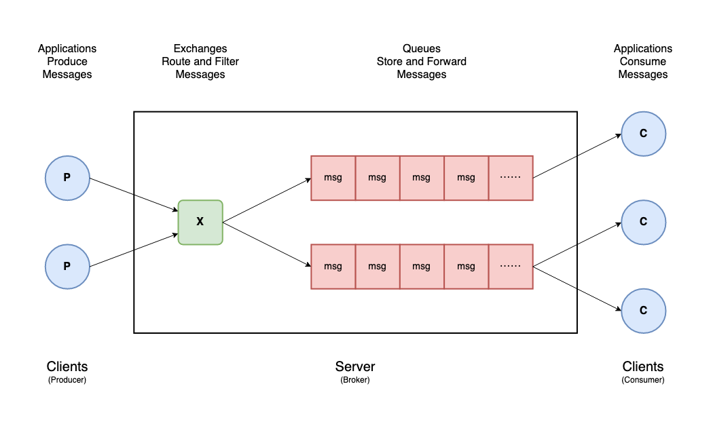

# [DATA] 訊息佇列 04 - RabbitMQ x Python 程式實作範例

<!--more-->

## 前言
上一篇文章我們已經把 RabbitMQ Server 的環境架設起來，並在網頁管理介面上體驗建立 Queue 和 Publish / Get 訊息，系列文的最後一篇終於要來寫 code 了，我們將使用 Python 的 Library - Pika 與 RabbitMQ 進行互動，撰寫 Client 端的 Producer 和 Consumer 程式碼。

<br>

**[ 系列文章目錄 ]**
1. [[DATA] 訊息佇列 01 - Message Queue 介紹與實際應用](/message-queue-introduction/)
2. [[DATA] 訊息佇列 02 - RabbitMQ 簡介與 5 種設計模式](/rabbitmq-introduction/)
3. [[DATA] 訊息佇列 03 - RabbitMQ 架設方法與網頁管理介面](/rabbitmq-management-interface/)
4. [[DATA] 訊息佇列 04 - RabbitMQ x Python 程式實作範例](/rabbitmq-python-example/)（本篇）

## RabbitMQ Clients & Server
上一篇我們透過 Docker 來運行 **RabbitMQ Server**，也就是 Producer - Broker - Consumer 架構中的 Broker；現在我們要來實作 **RabbitMQ Clients**，包含推送訊息的 Producer 和消化訊息的 Consumer。

<!--  -->


RabbitMQ Clients 有許多官方支持的 [Libraries and Develoer Tools](https://www.rabbitmq.com/devtools.html)，可根據你熟悉的程式語言做選擇，本文將使用 pure-Python 的 Library: **Pika**


## RabbitMQ Client Library (Python) - Pika

### Introduction
Pika 是一個純 Python 開發的 RabbitMQ 函式庫 [ [source code](https://pika.readthedocs.io/) ] [ [document](https://github.com/pika/pika/) ]
- 使用 AMQP 0-9-1 protocol
- 支援 Python 2.7 and 3.4+ 版


### Installation

使用 PyPI 就可以簡單安裝 Pika。

```bash
pip install pika
```



`aio-pika` 是使用 asyncio 的異步(Asynchronous)版的 RabbitMQ 函式庫 [ [source code](https://github.com/mosquito/aio-pika) ] [ [document](https://aio-pika.readthedocs.io/en/latest/) ]

同樣使用 PyPI 安裝：`pip install aio-pika`



### Development

#### 建立連線(Connetion & Channel)
與自己本機(localhost)架設的 RabbitMQ 建立連線（5672 port），使用之前建設定的帳號密碼，得到一個連線(connection)的通道(channel)。

接下來大部分的操作都是在通道(channel)上進行，包括宣告 Queue、定義 Exchange、绑定 Queue 與 Exchange、發佈/接收訊息等。

```python
import pika

credentials = pika.PlainCredentials('root', '1234')
parameters = pika.ConnectionParameters(host='localhost',
                                       port=5672,
                                       credentials=credentials)
connection = pika.BlockingConnection(parameters)
channel = connection.channel()
```



Connection 是應用程式與 Broker 的真實 TCP 連接，Channel 則是其中的一個虛擬連接（AMQP），我們可以在應用程式中使用任意數量的虛擬連接（Channel），而不會因過多 TCP 連接（Connection）而導致 Broker 過載。

一般來說可以使用一個 Channel 來處理所有事情，但如果你有多個線程(multiple threads)，建議為每個線程使用不同的 Channel。

更多詳細介紹可參考這篇：[RabbitMQ and relationship between channel and connection](https://stackoverflow.com/questions/18418936/rabbitmq-and-relationship-between-channel-and-connection)




#### 生產者(Producer)

首先宣告名稱為 `hello` 的 Queue（若不存在則會創建），接著對 Queue 發佈一則訊息 `Hello World!`，最後記得要關閉(close)連線。

在 RabbitMQ 中，訊息不能直接發送到 Queue，而必須經過一個 Exchange，本範例使用空字串 `exchange`，並使用與 Queue 名稱相同的 `routing_key` 綁定。

```python
channel.queue_declare(queue='hello')
# channel.queue_declare(queue=‘hello’, passive=False, durable=False, exclusive=False, auto_delete=False

msg = 'Hello World!'
channel.basic_publish(exchange='',
                      routing_key='hello',
                      body=msg)
print(f" [x] Sent '{msg}'")
#  [x] Sent 'Hello World!'

connection.close()
```


#### 消費者(Consumer)

首先同樣是宣告名稱為 `hello` 的 Queue（必須與 Producer 的相同），接著從 Queue 裡取出訊息，確認訊息處理完要 `ack`，告知 Queue 可拋棄訊息；反之，訊息處理不如預期要 `nack`，訊息將再次回到 Queue。



Acknowledgements 是一種用於傳遞和處理確認的機制，當 RabbitMQ 向 Consumer 傳遞訊息時，它需要知道訊息是否發送成功，透過 `method.delivery_tag` 標記識別訊息。
- `channel.basic_ack(method.delivery_tag)` 用於**肯定確認**
- `channel.basic_nack(method.delivery_tag)` 用於**否定確認**

另外 consume 訊息的方法中，可以帶 `auto_ack=True` 參數，意即訊息取出後就**自動肯定確認**。

更多詳細介紹可參考這篇：[Consumer Acknowledgements and Publisher Confirms](https://www.rabbitmq.com/confirms.html)


<br>

Pika 提供三種從 RabbitMQ Broker 消費(consume)訊息的方法：

##### 1. Using channel.basic_get() to consume a message

使用 `basic_get()` 方法，每次取出一則訊息，需要開發者手動調用。

```python
channel.queue_declare(queue='hello')

channel.basic_get(queue='hello', auto_ack=True)
method, properties, body = channel.basic_get(queue='hello', auto_ack=True)
print(f" [x] Received {body.decode()}")
# channel.basic_ack(method.delivery_tag)

connection.close()
```


##### 2. Using channel.basic_consume() to consume messages

使用 `basic_consume` 方法，指定收到訊息的 callback function，`channel.start_consuming()` 後就會持續監聽 Queue，直到手動關閉(stop)。

```python
channel.queue_declare(queue='hello')

def callback(ch, method, properties, body):

    print(f" [x] Received {body.decode()}")
    # channel.basic_ack(method.delivery_tag)

channel.basic_consume(queue='hello',
                      auto_ack=True,
                      on_message_callback=callback)

print(' [*] Waiting for messages. To exit press CTRL+C')
channel.start_consuming()

try:
    channel.start_consuming()
except KeyboardInterrupt:
    channel.stop_consuming()

connection.close()
```

<!-- [terminal]() -->

##### 3. Using channel.consume() generator to consume messages

`consume` 方法會返回生成器(generator)，用 for loop 迭代取出訊息；若 Consumer 與 Queue 沒有活動(訊息傳遞)的狀態持續 `inactivity_timeout` 秒，將會收到 `method`, `properties` & `body` 皆等於 `None`。

```python
channel.queue_declare(queue='hello')

for method, properties, body in channel.consume(queue='hello', auto_ack=True, inactivity_timeout=10):

    print(f" [x] Received {body.decode()}")
    # channel.basic_ack(method.delivery_tag)

    if method == None and properties == None and body == None:
        break

connection.close()
```
<!-- [terminal]() -->

<!-- #### Multi Consumer -->

<!-- prefetch_count -->
<!-- do something
sleep -->

#### 完整程式碼
##### `producer.py`

Producer 發佈 100 則訊息（字串 0 ~ 99）至名稱叫 `hello` 的 Queue。

```python
import pika


credentials = pika.PlainCredentials('root', '1234')
parameters = pika.ConnectionParameters(host='localhost',
                                       port=5672,
                                       credentials=credentials)
connection = pika.BlockingConnection(parameters)
channel = connection.channel()

channel.queue_declare(queue='hello')

for i in range(100):
    msg = str(i)
    channel.basic_publish(exchange='', 
                          routing_key='hello', 
                          body=msg)
    print(f" [x] Sent '{msg}'")

connection.close()
```

##### `consumer.py`

Consumer 從 Queue 裡取出訊息，每次取出一筆，在 callback function 打印出內容。

```python
import pika


credentials = pika.PlainCredentials('root', '1234')
parameters = pika.ConnectionParameters(host='localhost',
                                       port=5672,
                                       credentials=credentials)
connection = pika.BlockingConnection(parameters)
channel = connection.channel()

channel.queue_declare(queue='hello')

def callback(ch, method, properties, body):

    print(f" [x] Received {body.decode()}")
    # channel.basic_ack(method.delivery_tag)

channel.basic_consume(queue='hello',
                      auto_ack=True,
                      on_message_callback=callback)

print(' [*] Waiting for messages. To exit press CTRL+C')

try:
    channel.start_consuming()
except KeyboardInterrupt:
    channel.stop_consuming()

connection.close()
```

## 系列文總結
訊息佇列系列文終於寫完了，從介紹 Message Queue 是什麼開始，接著進入 RabbirMQ 簡介與設計模式，再到 RabbirMQ 架設和 Web UI 介紹，最後這篇是撰寫 Python 程式實作範例，其實還想補充更多我在專案中用到的一些技巧，不過就先放在心上吧～

<br>

讀者若有其他想知道的部分，或是實作上遇到的問題，可以在底下留言或聯繫告訴我！

<br>

**本系列完結。**

## 參考
https://pika.readthedocs.io/en/stable/modules/index.html

https://pika.readthedocs.io/en/stable/examples.html
